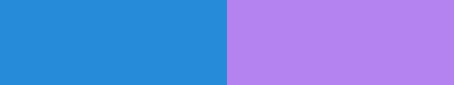

# Color Kit

`colorkit` is a lightweight `#[no_std]` color crate for Rust.

It provides an easy to use and strongly typed conversions between color spaces. Color Kit also provides layout and quantization tools for working with with pixel data. One can also implement additional/custom color spaces and layouts.

## Color Kit Overview

- `#[no_std]` friendly and dependency-free.
- Typed color spaces: `Srgb`, `LinSrgb`, `OkLab`, `Xyz<WhitePoint>` etc...
- Conversion API via `FromColor` / `IntoColor`.
- Alpha wrappers for normal and premultiplied color: `Alpha<T>`, `AlphaPre<T>`.
- Layout and quantization primitives: `Planar`, `MappedLayout`, `Packed565`.
- Built-in rounding and optional dithering hooks for scalar/layout conversions.

## Getting Started

Add `colorkit` to your `Cargo.toml`:

```toml
[dependencies]
colorkit = "0.1.0"
```

## Quick Start

### Conversion
Convert between color spaces with `IntoColor`:

```rust
use colorkit::{IntoColor, OkLab, Srgb};

let srgb = Srgb::new_u8(255, 128, 32);
let lab: OkLab = srgb.into_color();
let srgb_roundtrip: Srgb = lab.into_color();
```

#### Work in a Perctual color space and output in sRGB

```rust
let input = Srgb::new(0.15, 0.55, 0.85);
let mut lab: OkLab = input.into_color();

// Example adjustment in OkLab space:
lab.set_l(lab.l() + 0.08);
lab[1] += lab[1] * -2.5; // Index access of `a` channel.

let output: Srgb = lab.into_color();
```

This image shows the starting color and the end result:

