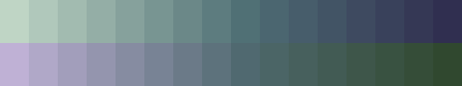

# Color Kit

`colorkit` is a lightweight `#[no_std]` color crate for Rust.

It provides an easy to use and strongly typed conversions between color spaces. Color Kit also provides layout and quantization tools for working with with pixel data. One can also implement additional/custom color spaces and layouts.

## Color Kit Overview

- `#[no_std]` friendly and dependency-free.
- Typed color spaces: `Srgb`, `LinSrgb`, `OkLab`, `Xyz<WhitePoint>` etc...
- Conversion API via `FromColor` / `IntoColor`.
- Alpha wrappers for normal and premultiplied color: `Alpha<T>`, `AlphaPre<T>`.
- Layout and quantization primitives: `Planar`, `MappedLayout`, `Packed565`.
- Built-in rounding and optional dithering hooks for scalar/layout conversions.

## Getting Started

Add `colorkit` to your `Cargo.toml`:

```toml
[dependencies]
colorkit = "0.1.0"
```

## Quick Start

### Conversion
Convert between color spaces with `IntoColor`:

```rust
use colorkit::{IntoColor, OkLab, Srgb};

let srgb = Srgb::new_u8(255, 128, 32);
let lab: OkLab = srgb.into_color();
let srgb_roundtrip: Srgb = lab.into_color();
```

#### Work in a Perctual color space and output in sRGB

```rust
let input = Srgb::new(0.15, 0.55, 0.85);
let mut lab: OkLab = input.into_color();

// Example adjustment in OkLab space:
lab.set_l(lab.l() + 0.08);
lab[1] += lab[1] * -2.5; // Index access of `a` channel.

let output: Srgb = lab.into_color();
```

This image shows the starting color and the end result:


### Using Data Layout

This example shows how to use layouts to load quantized data to and from a color space.

```rust
use colorkit::layout::Planar;
use colorkit::scalar::Rounding;
use colorkit::space::ColorLayout;
use colorkit::{ColorSlice, Srgb};

let mut data_out = [0u8; 48];
let data_in: [u8; 48] = [
    0xbf, 0xd5, 0xc5, 0xb0, 0xc8, 0xbb, 0xa2, 0xbb, 0xb0, 0x94, 0xae, 0xa6,
    0x86, 0xa1, 0x9c, 0x78, 0x95, 0x92, 0x6b, 0x88, 0x88, 0x5d, 0x7c, 0x7f,
    0x50, 0x70, 0x75, 0x4b, 0x66, 0x70, 0x47, 0x5d, 0x6b, 0x42, 0x54, 0x65, 
    0x3e, 0x4a, 0x60, 0x39, 0x41, 0x5b, 0x35, 0x38, 0x55, 0x30, 0x2f, 0x50,
];

let chk_in = data_in.as_chunks::<3>().0;
let chk_out = data_out.as_chunks_mut::<3>().0;
for (input, output) in chk_in.iter().zip(chk_out.iter_mut()) {
    // Use Planar layout to load colors.
    let mut color = Srgb::from_layout::<Planar<u8, 3>, _>(input);
    color.swap(1, 2); // Swap green and blue channels
    color[1] -= color.green() * 0.1; // Decrease green by 10%
    // Use Planar layout to store the color.
    *output = color.into_layout::<Planar<u8>>(Rounding::Nearest).into();
}
```
This image shows the starting color above and the result below:

